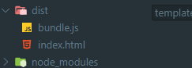

# Webpack 기본구조2

이번에는 webpack.config.js라는 파일을 통해 설정을 해보도록 하겠습니다.


entry키를 작성한뒤에 index.js값을 작성해주면 entry 경로가 설정됩니다. 

output은 bundle파일의 이름과 생성경로를 설정해주면 됩니다. 

단, 생성경로이기 때문에 절대경로를 입력해줍니다. 

먼저 절대경로를 사용하기 위해 **path**를 알아보겠습니다. 

```javascript
const path = require("path");

console.log(__dirname);

const pathTest = path.resolve(__dirname, "abc", "def");
console.log(pathTest);
```

```javascript
C:\Users\123\Desktop\웹팩
C:\Users\123\Desktop\웹팩\abc\def
```

`__dirname`은 현재 파일까지의 경로를 표현해주고,  `path.resolve`는 인자들 사이에 \ 를 넣어 연결해줍니다. 

```javascript
const path = require("path");

module.exports = {
  entry: "./src/index.js", //entry설정
  output: {
    path: path.resolve(__dirname, "dist"), //경로 + / + dist
    filename: "bundle.js",
  },
target: "node", //node환경
};
```

이제 실행을 해볼것인데 그전에 node의 내장모듈을 사용했으니, node환경이라는 것을 인식시켜 주기 위해 target을 지정해주었습니다. 


기본구조를 이루는 나머지 3가지 요소가 있습니다. 

1. Mode
2. Loader
3. Plugin

## Mode

모드를 알기전에 알아두어야 할 내용이 몇가지 있습니다. 

--save-dev , --save

패키지에는 두가지 용도가 있을수 있습니다. 

1. 어플리케이션 내부에 직접 포하모디는 모듈 \(React-dom\)
2. 개발과정에 필요한 모듈 \(redux-devtools-extension\)

이를 구분하기위해 pakage.json에는 두가지 Dependencies가 있습니다. 

다음과 같은 방법으로 사용할 수 있습니다. 

```javascript
--save       //1번
--save-dev   //2번
```

이렇게 하면 `npm install`을 통해 패키지들을 다운받을때에  개발모드에 필요한 모듈을 설치하지 않고, -dev를 붙이지 않은 모듈만을 설치해 줍니다. 

자세한 내용은 따로 살펴보도록 하겠습니다. 

## Loader

웹팩은 Entry를 시작점으로 다양한 파일을 다루는데 다양한 모듈들을 입력받아 처리하는 역할을 하게됩니다. 

Loader를 설정할때는 webpack설정파일에 module이라는 키를 웹팩설정파일에 추가하는 것으로 시작하는데, rules를 통해 loader들을 넣어 사용합니다. 

```javascript
module.exports = {
  module: {
    rules: [loader1, loader2],
  }
};
```

이제 html, js 파일을 만들어 브라우저에서 예시를 보도록 하겠습니다. 

```javascript
<!DOCTYPE html>
<html lang="en">
  <head>
    <meta charset="UTF-8" />
    <meta name="viewport" content="width=device-width, initial-scale=1.0" />
    <title>Webpack</title>
  </head>
  <body>
    <script src="./dist/bundle.js"></script> //번들파일을 설정
  </body>
</html>

============================================================================

function component() {
  const element = document.createElement("div");
  element.innerHTML = "Hello Webpack";
  return element;
}
document.body.appendChild(component);
```

이전에 설정한 웹펙 설정파일에서 target키만 제거를 해줄것인데 target을 입력하지 않으면, 브라우저 환경을 의미하는 web이라는 설정이 자동으로 들어가게 됩니다. 

```javascript
const path = require("path");

module.exports = {
  entry: "./index.js",
  output: {
    filename: "bundle.js",
    path: path.resolve(__dirname, "dist"),
  },
  mode: 'none',
};
```

이어서 pakage.json에 실행스크립트에 build를 통해 webpack을 실행하도록 하겠습니다. 

```javascript
{
  "name": "2",
  "version": "1.0.0",
  "description": "",
  "main": "index.js",
  "scripts": {
    "build": "webpack"
  },
  "author": "",
  "license": "ISC",
  "dependencies": {
    "webpack": "^4.44.1",
    "webpack-cli": "^3.3.12"
  }
}

//npm run build
```


실행을 해도 잘 나오는 것을 볼 수 있습니다. 


이제 loader를 통해 css를 불러오도록 하겠습니다. 

loader들은 외부에서 설치해주어야 하기 때문에 `style-loader`와 `css-loader`를 설치해주세요.

```javascript
const path = require("path");

module.exports = {
  entry: "./index.js",
  output: {
    filename: "bundle.js",
    path: path.resolve(__dirname, "dist"),
  },
  module: {
    rules: [
      {
        test: /\.css$/i, //어떤 파일들이 loader의 대상이되는지 정규표현식을 통해
        use: [
          //사용하는 loader를 지정하는 loader키, options키
          "style-loader",
          { loader: "css-loader" },
        ],
      },
    ],
  },
  mode: "none",
};
```

이제 css파일을 module로 불러오겠습니다. 

```javascript
npm i normalize.css
```

그리고 css파일을 import해주고, 글자 색을 바꿔주는 index.css파일을 만들어 함께 import해주세요.

```javascript
import "normalize.css";
import "./index.css";

function component() {
  const element = document.createElement("div");
  element.innerHTML = "Hello Webpack";
  return element;
}
document.body.appendChild(component());
```


options키 같은 경우에는 저장소의 readme.md파일을 통해 보통 확인이 가능합니다. 

css-loader의 옵션은 다음과 같습니다. 


```javascript
  module: {
    rules: [
      {
        test: /\.css$/i, //어떤 파일들이 loader의 대상이되는지 정규표현식을 통해
        use: [
          //사용하는 loader를 지정하는 loader키, options키
          "style-loader",
          {
            loader: "css-loader",
            options: {
              modules: true,
            },
          },
        ],
      },
    ],
  },
```

modules옵션을 설정해 주었습니다. 

```javascript
//index.css
.helloWebpack {
  color: blue;
}
=========================
//index.js

import "normalize.css";
import styles from "./index.css";

function component() {
  const element = document.createElement("div");
  element.innerHTML = "Hello Webpack";

  console.log(styles);

  element.classList = styles.helloWebpack;
  
  return element;
}
document.body.appendChild(component());
```

CSS는 선택자의 이름이 전역환경으로 적용되어서 App규모가 커지면 선택자 이름에 신경써야 하는데 modules 설정해주면, css파일별로 class이름이 같아도 겹치지 않습니다. 


style-loader는 처리하는 css파일별로 style태그를 만드는데, style태그 하나에서 한번에 style정보를 읽어오는 옵션을 적용해 보겠습니다. 


style-loader도 객체형태로 만들어 옵션을 넣어주었습니다. 

```javascript
  module: {
    rules: [
      {
        test: /\.css$/i, //어떤 파일들이 loader의 대상이되는지 정규표현식을 통해
        use: [
          //사용하는 loader를 지정하는 loader키, options키
          {
            loader: "style-loader",
            options: {
              injectType: "singletonStyleTag",
            },
          },
          {
            loader: "css-loader",
            options: {
              modules: true,
            },
          },
        ],
      },
    ],
  },
```


## plugin

웹펙의 동작과정에 영향을 줍니다. 번들파일에 변화를 주기도 하고, 개발모드에서 개발 편의성을, 배포모드에서 최적화를 해주는등 여러 역할을 해줍니다. 

```javascript
module.exports={
    plugins:[new Plugin({...option}),...]
}
```

html webpack plugin을 사용해보겠습니다.  플러그인은 외부플러그인과 내부에 포함된 플러그인으로 나뉘게 됩니다. 

```javascript
npm i html-webpack-plugin
```

```javascript
const path = require("path");
const HtmlWebpackPlugin = require("html-webpack-plugin");

module.exports = {
  entry: "./index.js",
  output: {
    filename: "bundle.js",
    path: path.resolve(__dirname, "dist"),
  },
  module: {
    rules: [
      {
        test: /\.css$/i, 
        use: [
          {
            loader: "style-loader",
            options: {
              injectType: "singletonStyleTag",
            },
          },
          {
            loader: "css-loader",
            options: {
              modules: true,
            },
          },
        ],
      },
    ],
  },
  plugins: [
    new HtmlWebpackPlugin({
      template: "./template.html", //index.html파일을 이름바꿔줬음.
    }),
  ],
  mode: "none",
};
```

플러그인을 불러왔고, plugins에 플러그인을 넣어주었는데, 옵션은 loader와 마찬가지로 외부저장소에서 확인할 수 있습니다. template는 자동으로 생성되는 html문서가 특정 파일을 사용해서 만들게 설정해줍니다. 



우리는 output을 통해 경로를 설정해주었는데, webpack이 이를통해 link나 src를 자동으로 설정해줍니다.

```javascript
<!DOCTYPE html>
<html lang="en">
  <head>
    <meta charset="UTF-8" />
    <meta name="viewport" content="width=device-width, initial-scale=1.0" />
    <title>Webpack</title>
  </head>
  <body>
    <script src="./dist/bundle.js"></script>
  <script src="bundle.js"></script></body> //자동으로 추가됨
</html>
```

